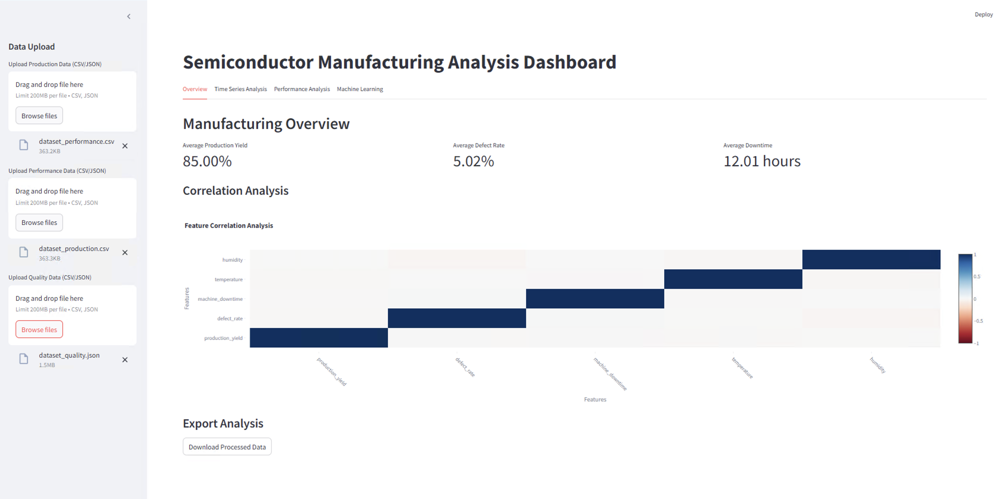
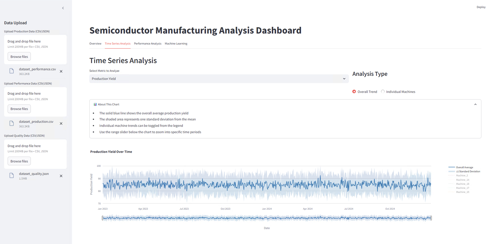
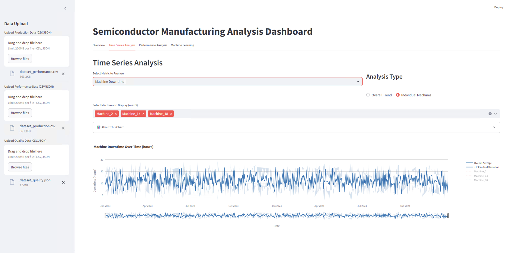
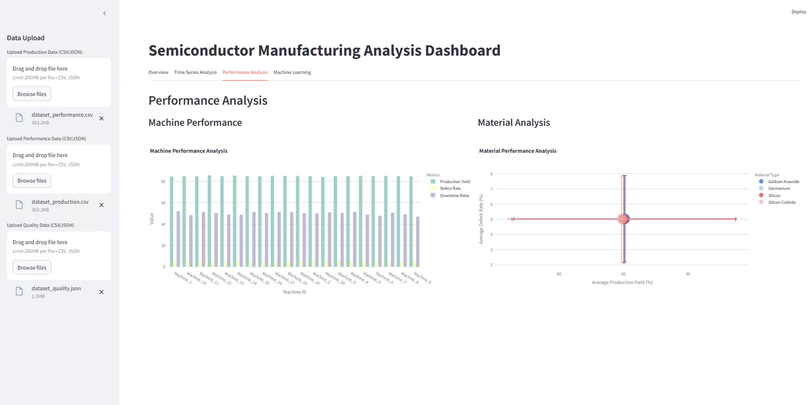
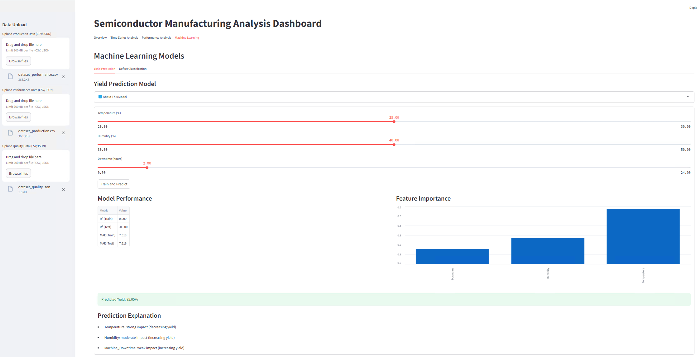
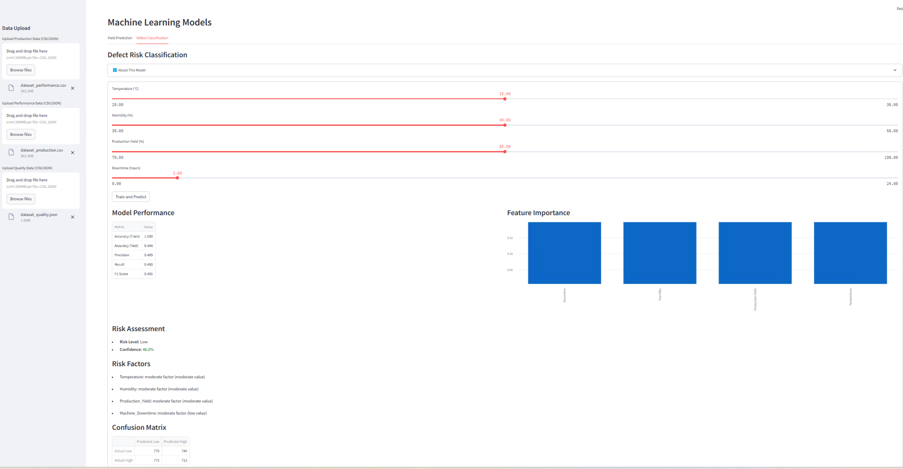

Semiconductor Manufacturing Analysis Dashboard
==============================================

This repository contains the code and resources for the Semiconductor Manufacturing Analysis Dashboard, an interactive tool designed to streamline the analysis of semiconductor manufacturing data. This dashboard enables users to upload data, perform time series analysis, evaluate performance, and leverage machine learning models for yield prediction and defect classification. Below is a comprehensive guide to the features and functionalities of the dashboard.

* * * * *

Features
--------

### 1\. **Data Upload**

-   **Purpose**: Allows users to upload production, performance, and quality data in CSV or JSON format.

-   **Details**:

    -   Supports files up to 200MB.

    -   Displays uploaded files for easy tracking.

### 2\. **Overview Tab**

-   **Purpose**: Provides a high-level summary of manufacturing performance.

-   **Metrics**:

    -   **Average Production Yield**: Displays overall yield percentage.

    -   **Average Defect Rate**: Highlights the defect percentage.

    -   **Average Downtime**: Shows average machine downtime in hours.

-   **Correlation Analysis**:

    -   Visualizes feature correlations (e.g., humidity, temperature, downtime) using a heatmap to uncover patterns.

### 3\. **Time Series Analysis**

-   **Purpose**: Allows users to explore trends over time.

-   **Features**:

    -   **Select Metrics**: Analyze production yield or machine downtime.

    -   **Analysis Types**:

        -   Overall Trend: Displays the aggregated trend.

        -   Individual Machines: Focuses on selected machines (up to 5).

    -   **Interactive Chart**:

        -   Includes zooming, panning, and toggling individual machine data.

        -   Standard deviation shading for variability insights.

### 4\. **Performance Analysis**

-   **Purpose**: Evaluates machine and material performance.

-   **Components**:

    -   **Machine Performance Analysis**:

        -   Bar chart comparison of metrics (e.g., production yield, defect rate, downtime ratio) across machines.

    -   **Material Performance Analysis**:

        -   Scatter plot with error bars showing average production yield vs. defect rate for different materials (e.g., Gallium Arsenide, Silicon).

### 5\. **Machine Learning Models**

#### A. Yield Prediction

-   **Purpose**: Predicts production yield based on input variables.

-   **Input Features**:

    -   Temperature (\u00b0C)

    -   Humidity (%)

    -   Downtime (hours)

-   **Outputs**:

    -   Predicted yield percentage.

    -   Model performance metrics (e.g., R\u00b2, MAE).

    -   Feature importance visualization.

#### B. Defect Risk Classification

-   **Purpose**: Classifies defect risk levels and highlights key factors.

-   **Input Features**:

    -   Temperature (\u00b0C)

    -   Humidity (%)

    -   Production Yield (%)

    -   Downtime (hours)

-   **Outputs**:

    -   Risk level and confidence score.

    -   Model performance metrics (e.g., accuracy, precision, recall, F1 score).

    -   Confusion matrix.

    -   Feature importance visualization.

* * * * *

Usage Instructions
------------------

### 1\. **Set Up Environment**

-   Clone the repository:

    ```
    git clone https://github.com/Hosseinglm/Semiconductor-Insights.git
    ```

-   Navigate to the project directory:

    ```
    cd semiconductor-Insights
    ```

-   Install required dependencies:

    ```
    pip install -r requirements.txt
    ```

### 2\. **Launch the Dashboard**

-   Run the application:

    ```
    python app.py
    ```

-   Open your browser and go to:

    ```
    http://localhost:5000
    ```

### 3\. **Interact with the Dashboard**

-   Upload the required datasets.

-   Navigate through tabs to explore data analysis, performance metrics, and machine learning predictions.

* * * * *

Example Datasets
----------------

Sample datasets are provided in the `data/` folder:

-   `dataset_production.csv`: Production data.

-   `dataset_performance.csv`: Performance data.

-   `dataset_quality.json`: Quality data.

* * * * *

Future Enhancements
-------------------

-   Integration with real-time data streams.

-   Advanced ML models.

-   Support for additional file formats.

-   Improved UI/UX design.

* * * * *

🖥️ Screenshots
---------------

### **Dashboard Overview**

### **Time Series Analysis - Overall Trends**
 
### **Time Series Analysis - Individual Trends Based on Machines**

### **Performance Analysis**

### **Machine Learning Models - Yield Prediction**
 
### **Machine Learning Models - Defect Classification**


License
-------

This project is licensed under the MIT License. See the `LICENSE` file for details.